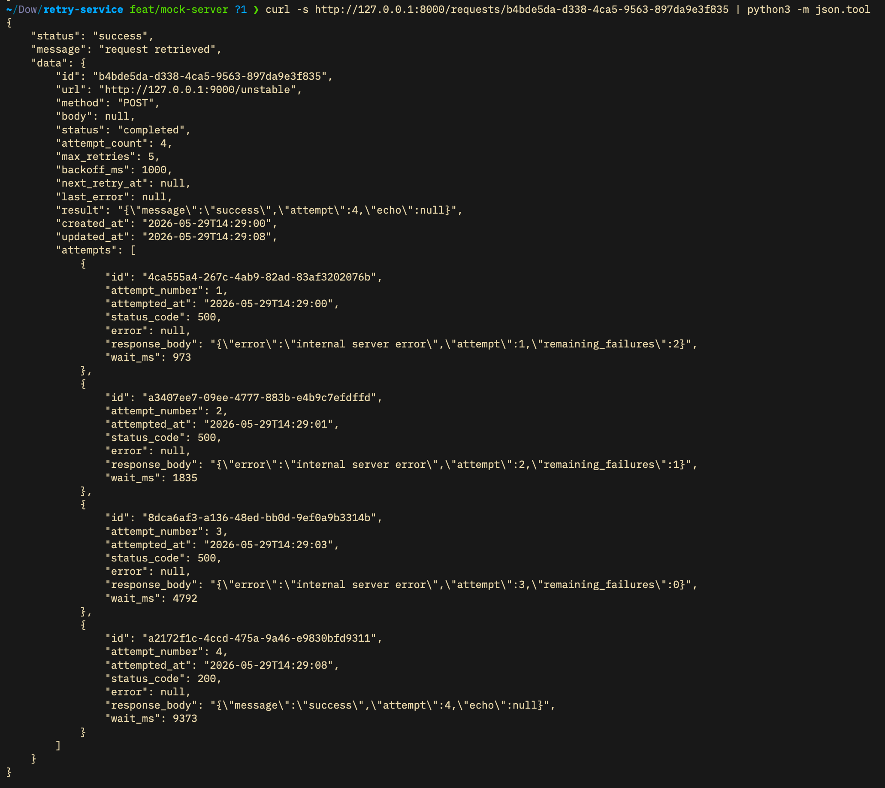

# Retry Service

An HTTP retry engine built with FastAPI and SQLite. This service accepts HTTP requests, queues them, and asynchronously executes them with exponential backoff and jitter. It handles transient failures (5xx) by retrying, while immediately failing on client errors (4xx).

## Setup Instructions

### Prerequisites
- Python 3.13+
- `uv` package manager

### Installation

Clone the repository and install dependencies using `uv`:

```bash
uv sync
```

### Running the Service

Start the Retry Service:
```bash
uv run uvicorn app.main:app --port 8000
```

Start the Mock Server (for testing):
```bash
uv run uvicorn mock_server:app --port 9000
```

## API Endpoints (`curl` Examples)

### 1. Enqueue a Request (`POST /requests`)
```bash
curl -X POST http://127.0.0.1:8000/requests \
  -H "Content-Type: application/json" \
  -d '{
    "url": "http://127.0.0.1:9000/unstable",
    "method": "POST",
    "body": "{\"payment\": \"test\"}",
    "max_retries": 5,
    "backoff_ms": 1000
  }'
```

### 2. Get Request Status (`GET /requests/:id`)
```bash
curl http://127.0.0.1:8000/requests/<request_id>
```

### 3. List All Requests (`GET /requests`)
```bash
curl http://127.0.0.1:8000/requests
```
*(Optional: filter by status `?status=completed` or `?status=retrying`)*

## Architecture

```mermaid
flowchart LR
    Client([Client]) -->|1. POST /requests| API[FastAPI App]
    API -->|2. Save State| DB[(SQLite)]
    API -.->|3. Return ID and status| Client 

    Worker[asyncio Worker] -->|4. Poll Due Requests| DB
    Worker -->|5. Execute HTTP| Ext[External Service]
    Ext -.->|6. Return Response| Worker
    DB <-|7. Update Status/Attempts| Worker
```

## Core Concepts

**Exponential Backoff & Jitter**
When a network request fails, immediately hitting the server again can worsen the outage ("thundering herd" and such). **Exponential backoff** solves this by increasing the wait time between retries (e.g., 1s, 2s, 4s, 8s). **Jitter** adds a random element to that wait time (e.g., ±20%) so that if multiple requests fail simultaneously, their retries are spread out rather than hitting the server at the exact same moment.

**Retryable vs. Terminal Errors**
Not all errors should be retried. 
- **Retryable Errors**: Transient issues like `500 Internal Server Error`, `502 Bad Gateway`, `503 Service Unavailable`, or network timeouts. These might succeed on a subsequent attempt.
- **Terminal Errors**: Client errors like `400 Bad Request` or `404 Not Found`. Retrying these will never change the outcome, so we fail them immediately to save resources.

**Screenshot of `GET /requests/:id`**


## Struggles & Bugs

- **`httpx` Null Body Bug**: I pinpointed an issue where `httpx` threw a `TypeError` when `request.body` was `None`. `httpx` expects a bytes-like object or a string, not `None`. I fixed this by checking for `None` and ensuring the `content` parameter is only passed when a body actually exists.
- **`httpx.Timeout` Bug**: Upgrading `httpx` to 0.28+ introduced stricter rules for the `Timeout` object, requiring all timeout parameters or a default fallback. I resolved this by updating the initialization to `httpx.Timeout(10.0, connect=5.0)` to stop `ValueError` exceptions from bubbling up.
- **Handling Redirects**: With my initial implementation, the worker only handled 200s, 400s, and 500s. This caused redirects (3xx) to be completely unhandled. I fixed this by ensuring the worker's HTTP client is configured to follow redirects (`follow_redirects=True`).

## What I Learned (Trade-offs & Alternatives)

During this project, I practiced considering alternatives, tradeoffs, and edge cases to choose suitable implementations and packages:

1. **ORM vs. Raw SQL**: I chose SQLAlchemy 2.0 (async) with `aiosqlite`. Raw SQL is fine for simple scripts but becomes a maintenance liability in a sizeable codebase (scattered string queries, no type safety). ORMs can obscure queries, but SQLAlchemy 2.0 provides type-safe models and explicit query construction with no magic. It also makes swapping SQLite for Postgres straightforward later, which matters for prototypes.
2. **Worker Implementation**: I evaluated Celery and `arq`. Celery is the industry standard but requires a broker (Redis/RabbitMQ) and separate worker processes, thus creating infrastructure overhead for a single-service prototype. `arq` is a good middle ground but still requires Redis. I opted for an **asyncio background task** inside the FastAPI `lifespan`. Since the requirement was just a polling loop, keeping it inside the FastAPI process keeps the service self-contained, simple to reason about, and deployable as a single container.

## Resources Consulted
- [FastAPI Documentation (Lifespan Events)](https://fastapi.tiangolo.com/advanced/events/)
- [SQLAlchemy 2.0 Asyncio Documentation](https://docs.sqlalchemy.org/en/20/orm/extensions/asyncio.html)
- [HTTPX Async Client Docs](https://www.python-httpx.org/async/)
- [AWS Architecture Blog: Exponential Backoff and Jitter](https://aws.amazon.com/blogs/architecture/exponential-backoff-and-jitter/)
- Various Stack Overflow and GitHub issue threads for `httpx` timeout changes and null body errors.

## Why This Made Me a Better Backend Developer

This project forced me to think beyond just making an API work to focusing on resilience and system design. By working through architectural choices like ORMs versus Raw SQL and in-process background tasks versus distributed queues, I practiced evaluating operational overhead and deployment complexity. I now more clearly understand how to protect downstream services from being overwhelmed using exponential backoff and jitter, and I'll more easily categorize errors into transient vs. terminal/client to handle failures gracefully in future production projects.
